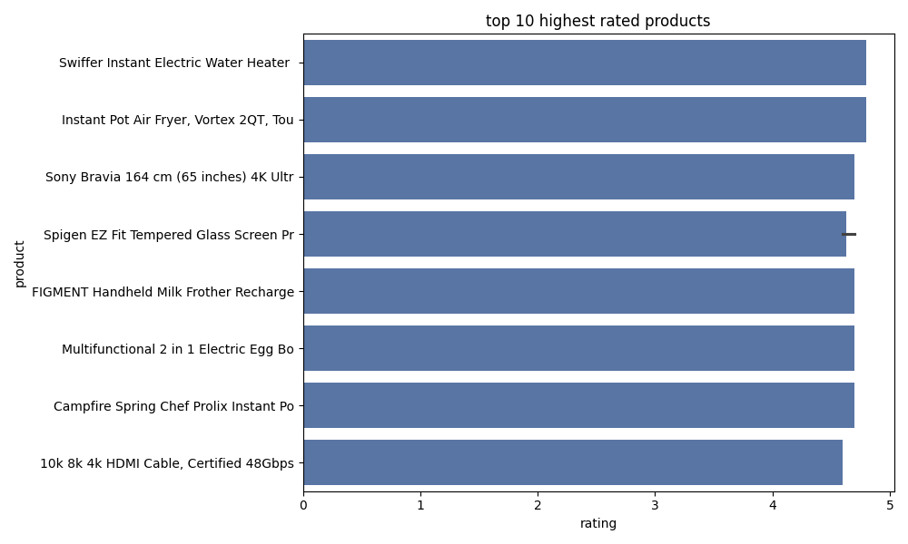
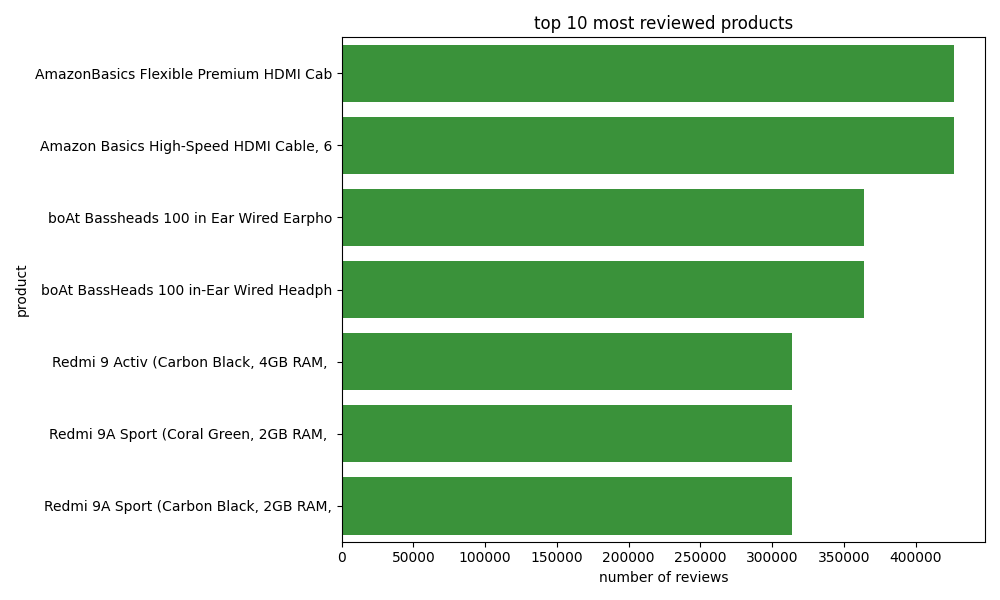
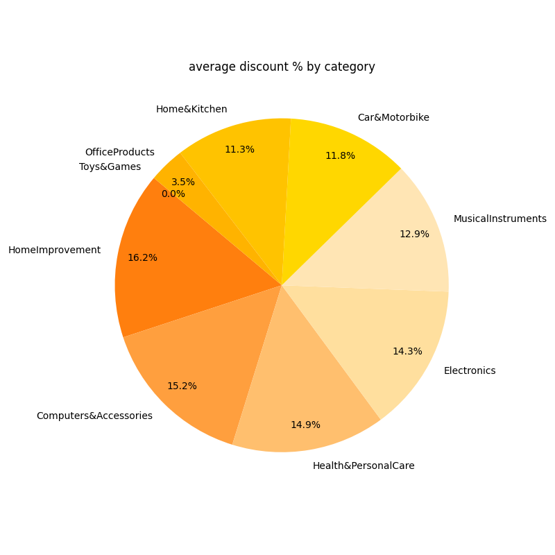
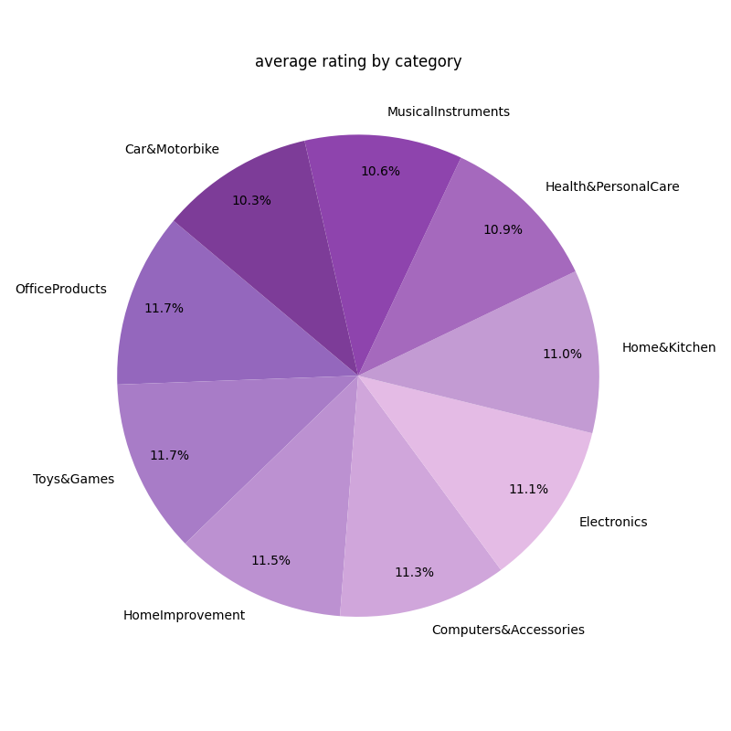
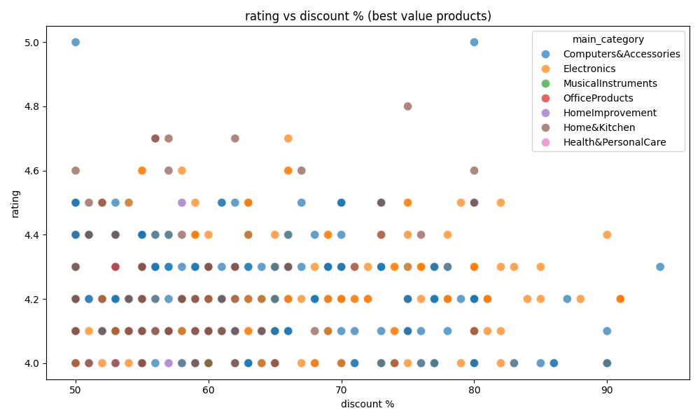

# Amazon Sales Dashboard

A data analysis project exploring Amazon India product listings.
Built using Python, SQLite, and Power BI.

## Project Steps

- Step 1 — Exploratory Data Analysis (EDA)
- Step 2 — Data Cleaning (type casting, null handling, string splitting)
- Step 3 — Loaded clean data into SQLite database
- Step 4 — SQL queries to extract KPIs
- Step 5 — Visualisation using Matplotlib and Seaborn
- Step 6 — Interactive Power BI dashboard

## Tools Used

- Python (Pandas, Matplotlib, Seaborn)
- SQLite (sqlite3)
- Power BI Desktop
- VS Code

## Dataset

- Source: Kaggle — Amazon India Product Listings
- Rows: 1,465 products
- Columns: 16

## KPIs Analysed

- Top 10 highest rated products
- Top 10 most reviewed products
- Average discount % by category
- Average rating by category
- Best value products (high rating + high discount)

## Charts







## Key Findings

- Electronics and Computers dominate Amazon India listings
- HomeImprovement has the highest average discount at 57.5%
- OfficeProducts has the highest average rating at 4.31
- AmazonBasics HDMI Cable is the most reviewed product with 426,973 reviews
```

---

## Step 5 — Commit your README

1. Scroll down after editing
2. Click **"Commit changes"**
3. Done! 
---
